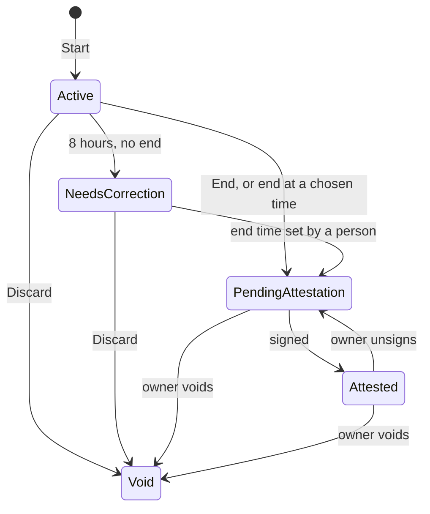

# ADR-010: Forgiving drive lifecycle, discard, end at a chosen time, and needs-correction instead of an invented end

## Context

The timer is the most frequent interaction in the product and it is operated by a teenager in a car. Mistakes are the normal case: Start tapped in the driveway before the plan changed, End forgotten until after dinner, a phone that died mid-drive. The original state machine had one answer for all of these, which was to wait 8 hours for a scheduled job to auto-close the drive, "flag" it, and surface it to the owner.

That answer has three problems.

**It invents evidence.** An auto-closed drive needs an `ended_at` to satisfy the check constraints and the classifier. Whatever the job chooses, start plus 8 hours or the time of the last heartbeat, is a number nobody witnessed, and it then flows into `day_minutes` and `night_minutes` and sits one signature away from a certified total. A record the owner swears to under penalty of perjury should not contain a computer's guess.

**It has no status.** "Flagged" was a word in the PRD and not a value in `DriveStatus`. A drive cannot be both `pending_attestation` and not-yet-real.

**It makes the user wait to fix their own mistake.** A driver who notices at 9pm that the 6pm timer is still running has to leave it running until the job catches it at 2am, then find it in the morning. The forgiving path costs one tap now and is the difference between a log that gets kept and a log that gets resented.

## Decision

Give the driver the tools to fix the three common mistakes in the moment, and when nobody does, park the drive in a state that waits for a human instead of guessing.

**Discard**

- The active drive screen has a Discard control, available to the driver and to any member with edit rights, with one confirmation. It moves the drive to `void`, clears `active_lock` in the same write, and logs who discarded it. A Start tapped by mistake costs nothing.
- Discard is also available on a `needs_correction` drive, for the case where the timer ran but the drive did not happen.

**End at a chosen time**

- Beside End Drive, "I forgot to stop" opens a time picker defaulted to the current time, constrained to after `started_at` and not in the future. Confirming ends the drive at that time through the same completion path as a normal end, so classification, the summary card, and the signature request all behave identically.
- The activity log records that the end was chosen rather than tapped. The attestation statement shows the times regardless, so the signer confirms what actually happened.

**Needs correction**

- `DriveStatus::NeedsCorrection` is added. A scheduled job moves any drive that has been `active` for more than 8 hours to `needs_correction`, clears `active_lock`, clears `next_checkin_at`, and leaves `ended_at` null. Nothing is classified.
- The driver and the owner are each texted a short, friendly note with an authenticated link that lands on the drive with the end time field focused. The message is worded as "looks like the timer kept running", never as an error.
- Setting an end time on a `needs_correction` drive runs the completion path and moves it to `pending_attestation`. Discarding moves it to `void`. Those are the only two exits.
- `needs_correction` is exempt from `drives_minutes_balance` and from the end-time half of `drives_timestamps_by_status`, exactly as `active` is, per `SPEC-001` and `ADR-008`. The model guard reads the exemption list from `DriveStatus::isUnclassified()` so the enum, the constraint, and the guard cannot disagree.
- Because `active_lock` is cleared, the driver can start a new drive while an old one waits for correction. The dashboard shows the waiting drive as a gentle card, not a blocker.

**Overlap**

- Saving a drive whose window overlaps another non-void drive on the same book shows the overlap and asks whether this is a duplicate. If the overlapping drive is attested, the save is blocked with a link to it. This catches the timed-drive-plus-manual-entry duplicate that would otherwise inflate a certified total with two signatures on one hour of driving.

**State machine**

## Consequences

**Good**

- No number in the compliance path is ever invented by the system. Every `ended_at` was tapped, typed, or texted by a person, and the activity log says which.
- The common mistakes are fixed where they happen, by the person who made them, in one or two taps. That is what "easy" means for a timer.
- The state machine is honest. A drive waiting for a human is visibly waiting, on the dashboard, in the readiness checklist, and in the report's exclusions.
- Clearing `active_lock` on the way into `needs_correction` means a forgotten drive never blocks the next one. Yesterday's mistake does not stop today's practice.

**Bad**

- One more status, one more exemption in two check constraints and a guard, and one more branch in every status-driven query. Mitigation: `isUnclassified()` is the single source for the exemption set, and the transition matrix test covers every pair.
- "End at a chosen time" lets a driver pick an end time that flatters the drive. This was already true of the client-supplied tap time in `ADR-005`, and it is bounded the same way: a supervising adult signs the statement with the times on it. The activity log additionally records that the end was chosen.
- Overlap detection is a query on every save. At a few hundred drives per book it is trivial. It does not attempt to detect near-duplicates that do not overlap.
- A `needs_correction` drive that nobody ever corrects sits forever. It appears on the readiness checklist so it cannot be forgotten at report time, and the owner can discard it there. No automatic expiry, because expiry would be the system deciding the drive did not happen.

**Neutral**

- The 8-hour threshold is unchanged from FR-4.5. It is the point past which no plausible drive is still running, not a deadline.
- The 2-hour check-in from `ADR-007` still runs first and now reaches the driver too. Most forgotten timers are caught there and never reach `needs_correction`.

## Alternatives considered

- **Auto-close at start plus 8 hours and flag it.** The original design. Rejected because it writes an end time nobody witnessed into a record someone will swear to.
- **Auto-close at the last heartbeat.** Better than start plus 8 hours and still a guess, and the heartbeat is designed to fail silently, so the last one may be minutes or hours before the car stopped. Rejected.
- **Let the classifier run on a null end and store zeros.** Satisfies the constraints and produces a signed drive of zero minutes, which is a lie in the other direction. Rejected.
- **Block starting a new drive while one needs correction.** Forces the correction to happen, and punishes today's drive for yesterday's mistake, in a product where the teenager's willingness to keep logging is the scarce resource. Rejected.
- **Delete drives on discard instead of voiding.** Simpler, and a discarded drive with no attestations could safely go. Rejected for consistency: nothing in this schema deletes, and a voided row with a reason is cheaper to reason about than an absence.

## Scope & Tenancy Impact

**Scope:** `DriveStatus`, the `drives` check constraints and model guard in `SPEC-001`, the active drive screen and the drive completion service in `SPEC-004`, the auto-close job, the overlap query on save, two message templates in `SPEC-008`, and the dashboard and readiness checklist rendering of waiting drives.

**Tenancy:** row-scoped. Every transition is performed on a drive resolved through the log book policy, and the overlap query is constrained to the same `log_book_id`, so a drive can never be compared with, blocked by, or corrected from another book. The needs-correction message is addressed to the book's driver and owner from their membership rows. `active_lock` continues to carry the `log_book_id` and is cleared in the same write as the status change, so the one-active-drive invariant survives the new state on every supported database.
