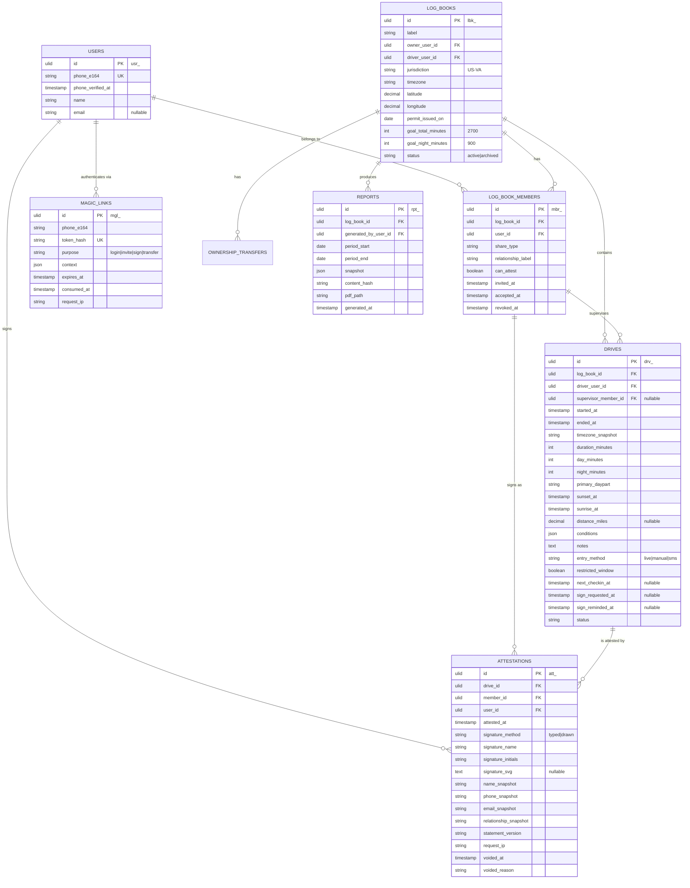
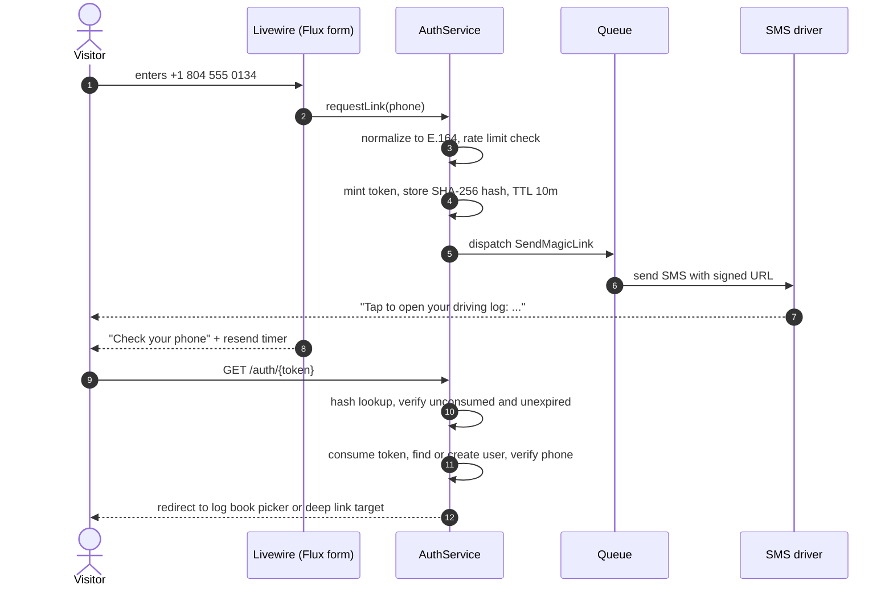
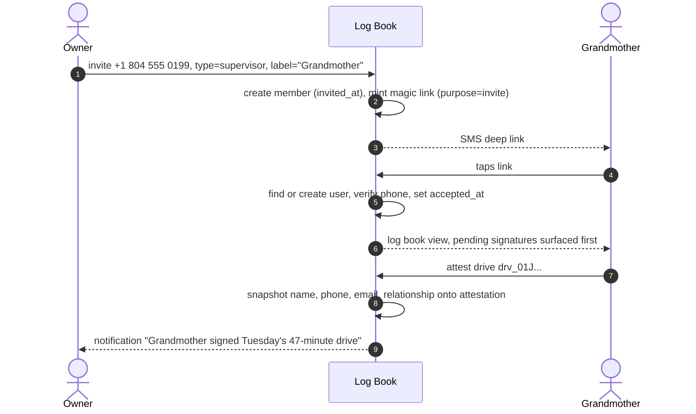
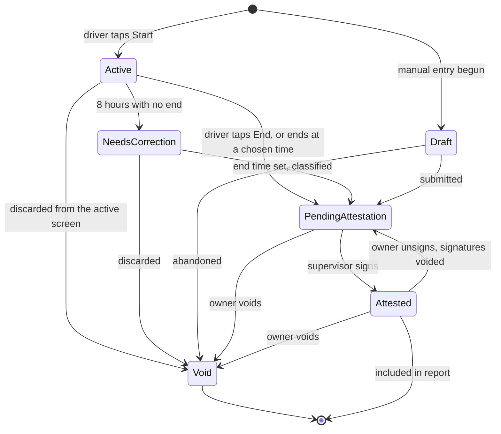

# Drive Log

## 1. Problem

A teen driver in Virginia must accumulate 45 hours of supervised practice, at least 15 of which occur after sunset, before a parent or guardian signs the DMV completion certificate under penalty of perjury. The state does not supply a log form, so families track this on paper, in a notes app, or in a spreadsheet.

Three things break in practice:

1. **The night hours get under-counted.** "After sunset" is a moving target that shifts by roughly two and a half hours between June and December in Richmond. A clock-based rule of thumb like "after 8pm" silently discards legitimate winter night hours and over-credits summer evening hours.
2. **The supervising adult is not always the record keeper.** A grandmother, an aunt, or a driving instructor rides along, then the log entry gets reconstructed days later by a parent who was not in the car. The certification is only as good as the memory of someone who was not there.
3. **Nothing is verifiable at the end.** The parent signs one certificate attesting to 45 hours with no underlying record of who supervised what.

Drive Log fixes all three by making the person in the passenger seat sign each entry from their own phone, with no account setup, and by doing the remembering for the family so nobody has to.

There is a fourth thing that breaks, and it is the one that decides whether the first three ever get fixed: compliance tools are joyless. A family that has already spent an afternoon in a DMV line will not adopt a second DMV. If the log is a chore, it gets skipped, and a skipped log is a reconstructed log. So the product has to be easy first, a little fun second, and rigorous underneath without ever making the rigor the user's problem.

## 2. Goals

- **G1.** A driver can start and stop a drive in two taps, and the timer survives a dead app, a locked screen, and a tunnel with no signal.
- **G2.** Day and night minutes are computed from actual sunset and sunrise at the log book's location, never guessed.
- **G3.** Any adult can be given access by phone number alone and sign an entry straight from the text they were sent, whenever they get to it, with no app install, no password, and nothing to remember. The app keeps track of what is waiting and asks kindly.
- **G4.** The finished log prints to a single document that a DMV clerk or driving school would accept without follow-up questions.
- **G5.** A signed entry cannot be silently altered after the fact.
- **G6.** Using it feels easy and a little bit fun. Every screen does one thing, the copy talks like a person, mistakes are one tap to fix, and progress is something the family gets to celebrate rather than a compliance chart.

The tone and interaction rules that G6 implies are recorded in [UX principles](UX-principles.md). They are requirements, not decoration, and `SPEC-009` builds from them.

### Non-goals

- Not a GPS tracker. Drive Log does not follow the vehicle or score driving behavior.
- Not a driver education curriculum or skills checklist.
- Not multi-tenant SaaS in V1. No organization layer, no billing, no driving school admin console.
- Not an official DMV integration. The output is a human-readable document, not an electronic filing.

## 3. Users and roles

Roles are scoped to a single log book, not to the application. The same person can be an owner on one log book and a supervisor on another.

| Role | Who | View log | Create/edit entries | Attest entries | Manage members | Transfer ownership |
| --- | --- | --- | --- | --- | --- | --- |
| `owner` | The certifying parent or guardian | Yes | Yes | Yes | Yes | Yes |
| `driver` | The teen accumulating hours | Yes | Own entries only, while unsigned | **No** | No | No |
| `parent_guardian` | Second parent, step-parent | Yes | Yes | Yes | Yes | No |
| `instructor` | Licensed driving instructor | Yes | Yes | Yes | No | No |
| `supervisor` | Grandmother, aunt, adult sibling, family friend | Yes | Unsigned entries only | Yes | No | No |
| `viewer` | Anyone given read-only access | Yes | No | No | No | No |

Create/edit applies to unsigned drives only. An attested drive is read-only until the owner unsigns it, per FR-6.7.

**Hard rule:** the driver can never attest their own entries. This is the single integrity property that makes the whole record meaningful. See [ADR-004: Attestation immutability](../adr/ADR-004-attestation-immutability.md).

**Second hard rule:** the owner is never the driver. The certifying adult originates the log book and names the driver by phone number. A check constraint on `log_books` rejects a book where the two are the same person.

## 4. Glossary

- **Log Book**: the shareable record for one driver working toward one licensing goal. The unit of ownership and sharing.
- **Drive**: one supervised driving session, whether timed live or entered manually.
- **Attestation**: a supervising adult's signed confirmation that a specific drive happened as recorded.
- **Daypart**: the human-facing bucket for a drive: morning, afternoon, evening, or night.
- **Night minutes**: minutes falling between sunset and sunrise at the log book's location. This is the compliance number and it is independent of daypart.
- **Certification Report**: the printable, immutable snapshot produced at the end.

## 5. Domain model

Prefixed ULIDs follow the existing `HasReferenceId` trait pattern. All timestamps are stored UTC and rendered in the log book timezone, never the viewer's.

## 6. Functional requirements

### 6.1 Authentication

- **FR-1.1** A visitor enters a phone number on the landing page and receives an SMS containing a single-use link.
- **FR-1.2** Following the link establishes an authenticated session and marks the phone verified. No password exists anywhere in the system.
- **FR-1.3** Tokens are single-use and stored hashed. Lifetime depends on purpose, because the person opening the link is not always sitting with the phone: `login` links expire in 10 minutes and are invalidated when a newer login link is issued for the same number; `invite`, `sign`, and `correct` links live 7 days and are independent of each other and of logins, so a fresh login link never kills an invitation that is still sitting unread or the recovery link for a drive waiting in `needs_correction`; `transfer` links live as long as the transfer they belong to, per FR-7.4.
- **FR-1.4** Requests are rate limited per phone number and per IP. The response is identical whether or not the number is known, so the endpoint cannot be used to enumerate users.
- **FR-1.5** Sessions are long-lived (30 days, sliding) so a supervising adult who signed once in March is still signed in come June.
- **FR-1.6** A user's display name is captured the first time it is needed, on the screen that needs it: the signing screen for a supervisor, the log book creation screen for an owner. There is no separate onboarding step and no profile gate. Email is optional and asked for once, after the first signature, with the plain reason that it prints on the report so a driving school can reach them.
- **FR-1.7** An expired or already-used link never shows an error. It shows one sentence and one button, "Text me a fresh link", which re-issues a token for the same number with the same purpose and context. A carrier-prefetched token is re-issued automatically without the button, per `ADR-001`.

See [ADR-001: Phone-first magic link auth](../adr/ADR-001-phone-first-magic-link-auth.md).

### 6.2 Log book selection and persistence of identity

- **FR-2.1** After authenticating, a user with exactly one log book membership is routed straight into it.
- **FR-2.2** A user with more than one membership sees a picker listing each log book with the driver's name, their own role, and progress.
- **FR-2.3** A user with no membership is offered the option to create a log book, becoming its owner. The creator enters the driver's name and phone number at creation; the driver is invited as `driver` and the name becomes their initial display name, so the report header is never blank because a teenager skipped a profile screen. A log book is always originated by the certifying adult, never by the driver, and the owner cannot be the driver.
- **FR-2.4** One owner may hold many log books. This matters directly: five children means five log books over time, and the second one should cost nothing to set up.
- **FR-2.5** Creation asks for a ZIP code, not coordinates. Latitude and longitude are resolved from a bundled ZIP centroid table with no network call, and the timezone defaults from the same lookup. The owner can correct either later. The permit issue date is optional at creation and prompted for gently on the dashboard until set.
- **FR-2.6** Visiting `/` with a live session goes straight to the picker, or to the book itself when there is only one. Nobody who is already signed in sees the phone entry form.

### 6.3 Sharing

- **FR-3.1** An owner or parent/guardian enters a phone number, selects a share type, and enters a relationship label such as "Grandmother" or "Driving instructor, Abba".
- **FR-3.2** The invitee receives an SMS with a magic link that authenticates them and lands them on the most useful screen: the signing screen if a drive is already waiting for them, otherwise the log book. Never a generic landing page, never a profile form.
- **FR-3.3** If the phone number already belongs to a user, the invite attaches to that existing account rather than creating a duplicate.
- **FR-3.4** Invites can be revoked. Revocation removes access going forward but never removes or invalidates attestations already made.
- **FR-3.5** The relationship label is required and appears on the printed report next to that person's signature.

### 6.4 Recording a drive

- **FR-4.1** The driver taps **Start Drive**, optionally selecting who is supervising from the member list, which defaults to whoever supervised last time. A `drives` row is written immediately with status `active`.
- **FR-4.2** The running timer is anchored to the server's `started_at`, so elapsed time is computed client-side from a fixed origin and stays correct through refreshes, backgrounding, and network loss. The start response also carries the server's current time, and the client applies that one-time offset so a phone whose clock is a minute off still shows the right elapsed time.
- **FR-4.3** Only one drive may be active per log book at a time. The dashboard reflects this: it shows **Start Drive** when nothing is running and the running drive with **End Drive** when one is. Tapping Start while a drive is running opens that drive; it is never an error.
- **FR-4.4** The driver taps **End Drive**. If the stop request fails due to connectivity, it is retried and the recorded `ended_at` is the moment of the tap, not the moment the server received it. If no supervisor was chosen at start, the end screen asks "Who was with you?" with the members listed as big tappable names. It can be skipped, in which case the signature request goes to the owner.
- **FR-4.5** A drive left active for more than 8 hours is moved to `needs_correction` by a scheduled job. No end time is invented and nothing is classified. The driver and the owner are each texted a friendly note with a `correct` link (7 days, per FR-1.3) whose context is that drive's id, so it lands on that drive with the end time field focused however long later it is opened and whatever drive is active by then. Once an end time is set the drive is classified and moves to `pending_attestation` like any other. See [ADR-010: Forgiving drive lifecycle](../adr/ADR-010-forgiving-drive-lifecycle.md).
- **FR-4.6** Manual entry allows a date, start time, and end time to be recorded after the fact, with `entry_method = manual`.
- **FR-4.7** Any in-progress form input is persisted server-side as a `draft` drive within 750ms of the last keystroke. Closing the browser mid-entry loses nothing.
- **FR-4.8** Optional fields: distance, weather, road type, traffic level, free-text notes.
- **FR-4.9** Entries that fall wholly or partly within Virginia's midnight to 4:00 a.m. restricted window for under-18 permit holders are accepted and stored with `restricted_window = true`, computed at completion alongside the other classifications. The UI shows a calm, explanatory badge rather than a warning banner. Their report treatment is FR-8.7.
- **FR-4.10** The driver can start and end a drive by text message. `BEGIN` or `GO` sent to the application number starts a drive with `entry_method = sms`; `DONE` or `FINISH` ends it. Keywords are case-insensitive and matched on the first word. The sender's phone number identifies them, and a command acts only when it resolves to exactly one active log book where the sender holds the right role: driver for starting, driver or owner for ending. Any other case replies with an authenticated link instead of guessing.
- **FR-4.11** `START`, `STOP`, `END`, `CANCEL`, `QUIT`, `UNSUBSCRIBE`, `STOPALL`, `YES`, `UNSTOP`, `HELP`, and `INFO` are carrier-reserved and are never commands. Every timer message states the correct keywords. If a driver with an active drive texts an opt-out word anyway, the drive is ended, since the intent is unambiguous, and the owner is told that the driver's number is opted out until it texts `START`.
- **FR-4.12** Every timer message the application sends, whether start confirmation, check-in, or auto-close notice, carries an authenticated deep link to the drive the message is about, keyed by drive id rather than "whatever is active". Start confirmations and check-ins use a `login` link; the auto-close notice uses a `correct` link per FR-4.5, because it is opened hours or days later. The timer can always be ended by tap when a keyword fails or the sender is ambiguous.
- **FR-4.13** When a drive has been active for 2 hours, the driver and the owner are each texted a check-in naming the driver and the elapsed time, because the person who forgot the timer is usually the one holding the phone. `DONE` from either ends the drive at the time of the reply. `CONTINUE` from the owner keeps it open and schedules another check-in 45 minutes later, for as long as the owner keeps replying. No reply changes nothing until the 8-hour move to `needs_correction` in FR-4.5.
- **FR-4.14** Any member whose role permits editing (owner, parent/guardian, instructor, supervisor) may modify a drive while it is unsigned. The driver may modify only their own unsigned drives. Every edit is written to the activity log with before and after values.
- **FR-4.15** An active drive can be discarded by the driver or any member with edit rights, from the active drive screen, with one tap and one confirmation. A Start tapped by mistake in the driveway should cost nothing. Discarding moves the drive to `void`.
- **FR-4.16** The active drive screen offers "I forgot to stop" alongside End Drive. It ends the drive at a time the user picks rather than now, so a timer left running through dinner is fixed in the moment instead of waiting for the 8-hour job.
- **FR-4.17** Saving a drive whose window overlaps another non-void drive on the same book shows the overlap and asks whether this is a duplicate. If the overlapping drive is already attested, the save is blocked with a link to the signed drive, because a signed drive plus a duplicate is how a certified total silently inflates.
- **FR-4.18** Ending a drive lands on a summary card: duration, minutes after sunset, the running totals, and the milestone if one was just crossed. The card has a share button that opens the phone's share sheet with a one-line summary, so the family group chat sees "Sam drove 47 minutes, 20 of them after sunset" without anyone typing it. This is the fun part and it doubles as the nudge that keeps everyone engaged.

See [ADR-007: SMS keyword timer control](../adr/ADR-007-sms-keyword-timer-control.md).

### 6.5 Time classification

- **FR-5.1** Every drive stores `day_minutes` and `night_minutes`, computed by intersecting the drive window with the sunset-to-sunrise window derived from the log book's latitude and longitude for the relevant dates.
- **FR-5.2** A drive spanning sunset splits correctly. A 5:40pm to 7:10pm November drive in Richmond records daytime minutes before sunset and night minutes after it, in the same entry.
- **FR-5.3** Every drive also stores a `primary_daypart` of morning, afternoon, evening, or night for human-facing display and filtering. This is clock-based and never used for compliance math.
- **FR-5.4** Both values are computed once at completion and stored. Later changes to classification rules do not retroactively alter signed history.
- **FR-5.5** Progress is displayed as running totals against both goals independently: total hours against 45 and night hours against 15. Goals are thresholds, not caps. Logging continues past them and the totals keep counting, because hours beyond the minimum are evidence, not excess.
- **FR-5.6** Drives supervised by a licensed instructor count toward both totals exactly like any other attested drive. There is no separate bucket and no cap on instructor hours.

See [ADR-003: Dual time classification](../adr/ADR-003-dual-time-classification.md).

### 6.6 Attestation

- **FR-6.1** Every completed drive enters status `pending_attestation`.
- **FR-6.2** Any member with `can_attest` may sign a pending drive. The driver may not, and the control is not rendered for them.
- **FR-6.3** Signing captures a typed full name, auto-derived editable initials, an optional signature drawn on a canvas, the attestation statement version, a timestamp, and the request IP. The name field is prefilled from the profile; on a first signature it is where the profile name gets set, per FR-1.6. The canvas sits below the statement, is clearly optional, and works in portrait on a 375px phone. The drawn signature is stored as SVG on the attestation row. If the canvas is left blank, the typed name is the signature and `signature_method` records `typed` rather than `drawn`.
- **FR-6.4** Signing snapshots the signer's name, phone, email, and relationship label onto the attestation row. Later profile edits do not rewrite historical signatures.
- **FR-6.5** The signer is shown the drive details and an explicit statement before signing, for example: *"I confirm I was present and supervising this drive on 14 November 2026 from 5:40pm to 7:10pm, a duration of 1 hour 30 minutes."* The button reads "Sign and confirm". There is no separate consent checkbox; the statement plus the button is the consent, and the `statement_version` records exactly what was shown.
- **FR-6.6** A drive with at least one live attestation is `attested` and becomes read-only.
- **FR-6.7** An owner may unsign an attested drive to correct it. Unsigning voids all existing attestations with a recorded reason, returns the drive to `pending_attestation` so it can be edited and signed again, and notifies every voided signer by SMS.
- **FR-6.8** Attestations are never deleted. Voided rows persist with `voided_at` and `voided_reason`.
- **FR-6.9** Multiple people may attest the same drive. All appear on the report.
- **FR-6.10** Unsign, edit, and re-sign events are written to the activity log with who, when, and why. They never print on the certification report, which renders live attestations only, per `ADR-006`.
- **FR-6.11** When a drive enters `pending_attestation`, the supervisor chosen for it is texted a signature request with a `sign` link that lands directly on the signing screen for that drive. If no supervisor was chosen, the request goes to the owner. A supervisor who is texted a request for a drive they were not on can tap "That wasn't me", which clears the supervisor and routes the request to the owner. See [ADR-009: Signature requests and gracious reminders](../adr/ADR-009-signature-requests-and-gracious-reminders.md).
- **FR-6.12** Reminders are gracious. A signer who has not signed after 3 days gets one more text, worded as a favour rather than a deadline, and then nothing further for that drive. The owner gets a weekly digest of what is waiting, only when something is. The words "overdue", "late", and "urgent" do not appear anywhere in the product.
- **FR-6.13** A signer with several drives waiting can sign them in one go. The batch screen lists the drives they supervised with the statement adapted to the set, one name and one optional drawing, and writes one attestation row per drive carrying the same signature. Nothing about invariant 1 or 2 changes; it is the same signature applied to each drive the person confirms.
- **FR-6.14** A signer's queue shows "Waiting for you" first, meaning drives where they are the chosen supervisor, and other unsigned drives collapsed beneath. Nobody is asked to sign something they were not there for by default.

### 6.7 Ownership transfer

- **FR-7.1** An owner nominates any accepted member other than the driver as the incoming owner.
- **FR-7.2** The nominee receives an SMS and must explicitly accept. Transfer is not unilateral.
- **FR-7.3** On acceptance, the swap is atomic: the nominee becomes `owner`, the outgoing owner is demoted to a role chosen at nomination time, defaulting to `parent_guardian`.
- **FR-7.4** Pending transfers expire after 7 days and can be cancelled by the initiator.
- **FR-7.5** Both the nomination and the acceptance are written to the activity log.
- **FR-7.6** A log book always has exactly one owner. The transfer runs inside a database transaction with a row lock.

### 6.8 Certification report

- **FR-8.1** Any member with attest rights can preview the report. Only the owner can generate a final one.
- **FR-8.2** The report covers a selectable date range, defaulting to the permit issue date through today, or the first drive through today when no permit date has been entered.
- **FR-8.3** Contents, in order:
  1. **Header**: driver name, log book label, jurisdiction, permit issue date, date range, report ID.
  2. **Summary**: total hours against the 45-hour goal, night hours against the 15-hour goal, drive count, date of first and last drive.
  3. **Log table**: one row per attested drive: date, start, end, duration, daypart, day/night minute split, conditions, supervisor initials rendered in a script face, and signature timestamp.
  4. **Supervisor appendix**: every person who signed, with name, relationship, phone, email, count of entries signed, and their drawn signature, or their typed name in the script face when no drawing was captured.
  5. **Certification block**: the statutory language and the owner's signature line.
  6. **Footer**: generation timestamp, report ID, page numbers, and a content hash for tamper evidence.
- **FR-8.4** The report renders as a print-optimized HTML page and as a downloadable PDF.
- **FR-8.5** Generation writes an immutable snapshot. Reprinting an existing report reproduces it byte for byte even if the underlying log has changed since.
- **FR-8.6** Drives in `pending_attestation` are excluded from the certified totals and listed separately as unsigned, so nothing silently inflates the number the owner is swearing to.
- **FR-8.7** Drives with `restricted_window = true` are excluded from the certified totals and listed in their own clearly labelled section with their own subtotal, alongside the unsigned section. The hours may not be creditable and the owner should not be swearing to them without seeing them called out.
- **FR-8.8** Before generating, the owner sees a readiness checklist: drives waiting for a signature, each with a "send a reminder" action; drives in `needs_correction`; drives in the restricted window; and members who signed but have no email on file. Everything on it is optional. The Generate button is always available and the checklist explains what the report will say if they proceed now.
- **FR-8.9** Every generated report is kept and listed on the report screen with its ID, date range, certified totals, generation time, and content hash, with print and download for each. Generating again never replaces an earlier report.
- **FR-8.10** A public page at `/verify/{report}` accepts a report ID and shows the generation date, the date range, the certified totals, and the content hash, and nothing else. A driving school holding a printout can confirm it matches what the system produced without an account. The page reveals no names, no drives, and no member details.
- **FR-8.11** Sharing the finished log with someone outside the family means sending them the PDF. The download uses the phone's share sheet so it can go straight to a text or email. Nobody outside the log book needs an account, and no report is reachable by URL alone.

See [ADR-006: Report snapshot and PDF](../adr/ADR-006-report-snapshot-and-pdf.md).

## 7. UI surface

Livewire 4 full-page components with Flux UI Pro. Mobile-first at 375px, since the primary device is a phone in a parked car at dusk.

| Screen | Route | Notes |
| --- | --- | --- |
| Landing / phone entry | `/` | Single `flux:input` with `tel` inputmode, one `flux:button`. Redirects when already signed in |
| Link sent | `/check-phone` | Resend countdown, edit-number affordance |
| Link expired | `/auth/expired` | One sentence, one button: "Text me a fresh link" |
| Log book picker | `/books` | `flux:card` per book with progress rings |
| Create log book | `/books/create` | Driver name and phone, ZIP code, optional permit date, label defaulted from the driver's name |
| Dashboard | `/books/{book}` | Dual progress rings, Start Drive or the running drive, "waiting for a signature" list, next milestone |
| Active drive | `/books/{book}/driving` | Large elapsed timer, supervisor picker, End Drive, "I forgot to stop", Discard |
| Drive complete | `/books/{book}/drives/{drive}` | Summary card with share button, milestone celebration, who will be asked to sign |
| Manual entry | `/books/{book}/drives/create` | `flux:date-picker`, time fields, supervisor picker, overlap check, autosaving draft |
| Drive list | `/books/{book}/drives` | Status via `flux:badge`, filter by daypart and signer |
| Attestation | `/books/{book}/drives/{drive}/sign` | Statement, name prefilled, optional signature canvas (`signature_pad`), "Sign and confirm" |
| Batch attestation | `/books/{book}/sign` | "Waiting for you" list with checkboxes, one statement, one signature |
| Members | `/books/{book}/members` | Invite form, role and relationship, revoke |
| Transfer ownership | `/books/{book}/transfer` | `flux:modal` with confirmation copy |
| Report | `/books/{book}/report` | Readiness checklist, range selection, preview, generate, history of past reports |
| Verify | `/verify/{report}` | Public. Report ID, range, totals, hash. Nothing else |
| Profile | `/profile` | Name, email. Timezone lives on the log book, not the person |

Design notes:

- Night-drive UI should default to a dark surface. The most common moment for a supervisor to sign is sitting in a driveway at 9pm.
- Attestation is the highest-value action for a first-time visitor. The link they were texted lands on the signing screen for the drive in question, the name is the only thing they have to type, and the drawing is optional. Whether they do it in the driveway or three days later, the path is the same and the copy is the same.
- Progress against 15 night hours deserves equal visual weight to the 45-hour total. Under-counting night hours is the most common way families fall behind.
- Milestones are celebrated: first drive, first night drive, 10 hours, halfway on either goal, and each goal met. A short animation on the summary card and a one-line text to the owner. Cheap to build and the reason a teenager opens the app on their own.
- The full rule set for tone, copy, and interaction is in [UX principles](UX-principles.md).

Verify current Flux Pro component availability against the Flux docs before committing to `flux:date-picker` and `flux:table` in the build.

See [ADR-005: Livewire and Flux UI layer](../adr/ADR-005-livewire-flux-ui-layer.md).

## 8. Technical architecture

| Layer | Choice | Rationale |
| --- | --- | --- |
| Framework | Laravel 13, PHP 8.5 | House standard |
| UI | Livewire 4 + Flux UI Pro + Tailwind 4 | Server-driven, one deployable, no API surface to secure |
| Database | Any Laravel-supported relational database: MySQL, MariaDB, PostgreSQL, or SQLite | Portable schema so the app runs wherever Laravel does. See [ADR-008: Database-agnostic schema](../adr/ADR-008-database-agnostic-schema.md) |
| Identity | Custom phone guard, no Fortify or Breeze | No password primitives to secure or leak |
| Authorization | Laravel policies over `log_book_members` | Roles are per-record, not global. See [ADR-002: Per-log-book membership authorization](../adr/ADR-002-per-logbook-membership-authorization.md) |
| SMS | Driver contract with Twilio as primary, plus one inbound webhook for timer keywords and check-in replies | Reuse the pluggable driver pattern from Burn After Reading v2. See [ADR-007: SMS keyword timer control](../adr/ADR-007-sms-keyword-timer-control.md) |
| Queue | Database driver at V1 | Redis and Horizon only if SMS volume justifies it |
| Sun times | PHP `date_sun_info()` | Native, no dependency, no external API call, no rate limit |
| Location | Bundled ZIP centroid table, US only at V1 | The owner types a ZIP; coordinates and timezone resolve locally. No geocoding service, no API key, nothing to fail at setup |
| Audit | `spatie/laravel-activitylog` | Member changes, drive edits, unsigns, voids, transfers. Never rendered on the report |
| PDF | `barryvdh/laravel-dompdf` with Inter and Dancing Script embedded as static TTF, both SIL OFL 1.1 | Table-heavy document, no headless Chrome on the box |
| Signatures | `signature_pad` (MIT) in an Alpine component, stored as SVG text on the attestation | Vector, no image storage path, renders in DomPDF through an `` data URI |
| Hosting | Any Laravel-compatible host: one PHP 8.5 web process, a queue worker, the scheduler, a relational database, and a private disk | The workload is a handful of writes per day; nothing here needs a specific platform |

### Constraints worth enforcing in the schema

- A unique index on the nullable `drives.active_lock` column, which equals `log_book_id` only while the drive is active, guarantees one active drive per book on every supported database.
- `log_books.owner_user_id` is non-nullable, and transfer runs under `lockForUpdate()` inside a transaction.
- `attestations` has no `UPDATE` path in application code except setting `voided_at` and `voided_reason`.
- A check constraint asserting `day_minutes + night_minutes = duration_minutes` catches classification bugs at the database boundary on engines that support it, and a model guard asserts the same rule everywhere. See [ADR-008: Database-agnostic schema](../adr/ADR-008-database-agnostic-schema.md).

## 9. Compliance and operational reality

- **Virginia requirement.** 45 hours total with at least 15 after sunset, certified by a parent or guardian. The certification is made under penalty of perjury, which is precisely why per-entry attestation and tamper-evident reporting matter here rather than being over-engineering.
- **Restricted hours.** Under-18 permit holders may not drive between midnight and 4:00 a.m. Store the flag at completion, show it calmly, and keep those minutes out of the certified totals per FR-8.7.
- **A2P 10DLC.** US application-to-person SMS over long codes requires brand and campaign registration with the carriers. This is a lead-time item, not a code item. Start it before the build finishes or launch will stall on it.
- **Consent language.** The first SMS to any number must identify the sender and include opt-out instructions. Honor STOP. Timer keywords never collide with the reserved opt-out, opt-in, and help words, per FR-4.11.
- **Minor's data.** The driver is a minor. Collect the minimum: name, phone, drive times. No location history beyond the log book's static coordinates, no birthdate unless the report genuinely requires it.
- **Retention.** Signed history is never deleted, per `ADR-004`, so "delete my log book" means archive it and scrub it: the book moves to `archived`, member contact details are replaced with placeholders on `users` rows that belong to no other book, and the snapshots on attestations and reports stay intact because they are the evidence the owner may still be asked for. Purge magic link rows after 30 days. Offer archive 12 months after the goal is met, as a suggestion rather than an automatic action.

## 10. Release plan

**M1: Skeleton (week 1)**
Schema, models, prefixed ULIDs, policies, factories, seeders. Phone auth end to end with a log SMS driver. Log book creation and picker.

**M2: The core loop (week 2)**
Start and stop a drive, server-anchored timer with clock offset, discard, "I forgot to stop", the `needs_correction` path, manual entry with overlap check, draft persistence, sunset-based day/night classification with unit tests across a full solar year, the drive summary card.

**M3: Sharing and signing (week 3)**
Invites, purpose-scoped link lifetimes and the expired-link page, role assignment, signature requests at drive end, gracious reminders and the owner digest, attestation with snapshotting and the signature canvas, batch signing, unsign and void, SMS keyword timer control, the long-drive check-in to driver and owner, milestone messages.

**M4: The deliverable (week 4)**
Readiness checklist, report snapshot, print stylesheet, PDF export via the share sheet, signature rendering, supervisor appendix, restricted-window and unsigned sections, content hash, report history, the public verify page.

**M5: Hardening**
Rate limits, real SMS driver plus 10DLC registration, auto-close job, activity log surfacing, accessibility pass, dark mode.

## 11. Resolved questions

Answered by Tim Wood on 2026-08-26. Recorded here so the reasoning survives; the requirements above already reflect the answers.

1. **"After sunset" means sunset to sunrise.** A 5:30am winter drive is night driving. `ADR-003`, FR-5.1.
2. **Instructor behind-the-wheel hours count toward the totals,** folded in like any other attested drive. Totals are running tallies with no cap at 45 or 15; the goals are thresholds the tally is shown against. FR-5.5, FR-5.6.
3. **The parent originates the log book.** The creator becomes owner and names the driver by phone number. The owner is never the driver, enforced by a check constraint. FR-2.3, `SPEC-001`.
4. **Drawn signatures ship in V1.** Typed name and initials are captured on every attestation; a `signature_pad` canvas captures the drawn signature as SVG, with the typed name as the fallback when the canvas is blank. FR-6.3, `ADR-004`, `ADR-006`.
5. **Typefaces are Inter for the body and Dancing Script for signatures,** both SIL OFL 1.1, embedded as static TTF with subsetting. Same-license alternatives if the look needs adjusting: Caveat (handwritten, less formal), Allura and Great Vibes (more formal), Sacramento (cleanest, thin strokes, check legibility at table sizes). `ADR-006`.
6. **Supervisors read the whole log book.** Full read for every accepted member, as the role table already states. Revisit only if a driving school ever becomes a member as a vendor.

Decisions from the experience review on 2026-08-26, recorded in [the session log](../sessions/2026-08-26-experience-review-and-gracious-direction.md):

7. **Link lifetime follows purpose.** Ten minutes was right for login and wrong for everything else. FR-1.3, `ADR-001`.
8. **The app asks, it never nags.** One request, one reminder, one weekly owner digest. FR-6.11 to FR-6.12, `ADR-009`.
9. **An auto-closed drive gets no invented end time.** It waits in `needs_correction` for a human. FR-4.5, `ADR-010`.
10. **Restricted-window minutes stay out of the certified total.** Listed, not counted. FR-8.7. Confirm with a driving school before the report language hardens.

### Open

1. **A driver without their own phone.** `log_books.driver_user_id` is not null, so a teenager who shares a parent's number, or has no phone, cannot be the driver of a book today. The fix is a book whose driver is a name until a phone is attached, which changes the schema and the owner-not-driver constraint. Decide before M1 migrations freeze. Nothing else in this document depends on the answer.

## 12. Future

- Multi-jurisdiction rule packs, since the 45/15 numbers and the sunset definition are state-specific.
- Weekly nudge SMS when night-hour pace falls behind the calendar.
- Offline-capable timer with a service worker and a queued stop event.
- Export to the log formats specific driving schools request.
