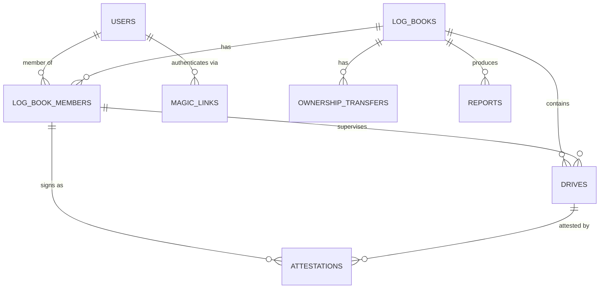

# SPEC-001: Data model and migrations

## Goal

Every table, constraint, and model exists so subsequent slices have something to build against. Nothing user-facing ships from this spec. What it delivers is a schema where the domain invariants are enforced by the database wherever the driver can and by the model layer everywhere, rather than by hope, so that a later bug in application code above the models cannot produce a corrupt log.

## In scope

- Migrations for all eight application tables
- Eloquent models with relationships, casts, and prefixed ULIDs
- The `ShareType` enum with its capability methods
- The `DriveStatus` and `Daypart` enums
- Database-level constraints and indexes
- Factories and a development seeder
- `spatie/laravel-activitylog` installation and configuration

## Out of scope

- Authentication and the phone guard. `SPEC-002`
- Policies and the global scope. `SPEC-003`
- The classification computation itself, though its columns are created here. `SPEC-005`
- Any Livewire component or route

## Decisions this inherits

| Decision | Source | What it constrains here |
| --- | --- | --- |
| Roles are membership rows, not global roles | `ADR-002` | No `roles` or `permissions` tables. `share_type` is a column on `log_book_members` |
| Attestations are append-only | `ADR-004` | `ON DELETE RESTRICT` on attestation foreign keys, no cascade anywhere near signed history |
| Contact details are snapshotted | `ADR-004` | Denormalized `*_snapshot` columns on `attestations`, deliberately not normalized away |
| Two independent time classifications | `ADR-003` | Both `night_minutes` and `primary_daypart` exist, with a check constraint on the minute split |
| Prefixed ULIDs | House standard | `HasReferenceId` trait on every model, no auto-increment primary keys |
| The timer is also driven by SMS | `ADR-007` | `entry_method` gains `sms`; `next_checkin_at` on `drives` |
| The schema runs on any Laravel-supported relational database | `ADR-008` | Portable column types, unique-on-nullable lock columns instead of partial indexes, check constraints only where supported and mirrored by model guards |
| A forgotten timer waits for a human rather than getting an invented end time | `ADR-010` | `DriveStatus::NeedsCorrection`, exempt from the minute and end-time checks exactly as `active` is |
| Signature requests and one gracious reminder are tracked per drive | `ADR-009` | `sign_requested_at` and `sign_reminded_at` on `drives`; `sign` joins the magic link purposes |
| Restricted-window drives are classified once and kept out of certified totals | PRD FR-4.9, FR-8.7 | `restricted_window` on `drives`, computed at completion alongside the minute split |
| Link lifetime follows purpose | `ADR-001` | `expires_at` is set from `purpose` at minting; no single TTL constant |

## Data model



Column type conventions: every timestamp is a UTC `datetime`; timezone awareness lives in the application and the stored `timezone` strings, never in the column type. JSON columns use the builder's `json()` type. IP addresses are `varchar(45)`. Nothing in the schema uses an engine-specific type, per `ADR-008`. SQLite enforces foreign keys only with `foreign_key_constraints` enabled, which is Laravel's default; leave it on.

### `users`

| Column | Type | Notes |
| --- | --- | --- |
| `id` | `char(30)` PK | `usr_` prefixed ULID |
| `phone_e164` | `varchar(20)` | **unique**, the identity key |
| `phone_verified_at` | `datetime` nullable | Set on first successful magic link consumption |
| `name` | `varchar(120)` nullable | Required before the user may attest |
| `email` | `varchar(255)` nullable | Not unique. Two family members may share one |
| `created_at`, `updated_at` | `datetime` | |

There is no timezone on the user. Every time in the product renders in the log book's timezone, so a per-person timezone would be collected and never read.

Globally scoped. This is the only table outside the log book isolation boundary, per `ADR-002`.

### `magic_links`

| Column | Type | Notes |
| --- | --- | --- |
| `id` | `char(30)` PK | `mgl_` |
| `phone_e164` | `varchar(20)` | Indexed. Not a foreign key, since the user may not exist yet |
| `token_hash` | `char(64)` | **unique**, SHA-256 of the plaintext token |
| `purpose` | `varchar(20)` | `login`, `invite`, `sign`, `transfer` |
| `context` | `json` nullable | Deep link target, for example `{"log_book_id": "lbk_..."}` or `{"drive_id": "drv_..."}` for `sign` |
| `expires_at` | `datetime` | Set from `purpose` at minting: 10 minutes for `login`, 7 days for `invite` and `sign`, the transfer's own `expires_at` for `transfer`. PRD FR-1.3 |
| `consumed_at` | `datetime` nullable | |
| `request_ip` | `varchar(45)` nullable | |
| `created_at` | `datetime` | |

Index on `(phone_e164, purpose, consumed_at)` for invalidating prior tokens. Only `login` tokens invalidate their predecessors; an outstanding `invite` or `sign` link is never killed by a later login. Scheduled purge of rows older than 30 days.

### `log_books`

| Column | Type | Notes |
| --- | --- | --- |
| `id` | `char(30)` PK | `lbk_` |
| `label` | `varchar(120)` | For example "Sam's permit log" |
| `owner_user_id` | `char(30)` FK → users | **not null**, `ON DELETE RESTRICT` |
| `driver_user_id` | `char(30)` FK → users | **not null**, `ON DELETE RESTRICT` |
| `jurisdiction` | `varchar(10)` | `US-VA` |
| `timezone` | `varchar(64)` | Classification and display both use this, never the viewer's |
| `latitude` | `decimal(9,6)` | Sunset computation input |
| `longitude` | `decimal(9,6)` | |
| `permit_issued_on` | `date` nullable | |
| `goal_total_minutes` | `integer` | Default `2700` (45 hours) |
| `goal_night_minutes` | `integer` | Default `900` (15 hours) |
| `status` | `varchar(20)` | `active`, `archived` |

Goals live per book rather than in config, which is the seam a future jurisdiction rule pack extends without a schema change. They are thresholds, not caps; nothing in the schema or the application stops logging past them.

Check constraint `log_books_owner_not_driver` asserts `owner_user_id <> driver_user_id`. The certifying adult originates the book and names the driver; a book where the two are the same person cannot exist, and an ownership transfer to the driver is rejected by the same constraint.

`driver_user_id` being not null is the one column in this spec with an open question against it: a driver who has no phone of their own cannot be represented. If the answer in PRD section 11 is to allow it, this column becomes nullable, a `driver_name` column is added to the book, and the check constraint becomes `owner_user_id <> driver_user_id OR driver_user_id IS NULL`. Decide before this migration is written.

### `log_book_members`

| Column | Type | Notes |
| --- | --- | --- |
| `id` | `char(30)` PK | `mbr_` |
| `log_book_id` | `char(30)` FK | `ON DELETE RESTRICT` |
| `user_id` | `char(30)` FK | `ON DELETE RESTRICT` |
| `share_type` | `varchar(20)` | `ShareType` enum |
| `relationship_label` | `varchar(80)` | **not null**. Prints on the report |
| `can_attest` | `boolean` | Default derived from `share_type` at creation |
| `invited_by_user_id` | `char(30)` FK nullable | |
| `invited_at`, `accepted_at`, `revoked_at` | `datetime` nullable | |

Unique on `(log_book_id, user_id)`. Revocation is a timestamp; rows are never deleted, so the `RESTRICT` constraint from attestations is never contended.

### `drives`

| Column | Type | Notes |
| --- | --- | --- |
| `id` | `char(30)` PK | `drv_` |
| `log_book_id` | `char(30)` FK | `ON DELETE RESTRICT` |
| `driver_user_id` | `char(30)` FK | |
| `supervisor_member_id` | `char(30)` FK nullable | Who was in the passenger seat |
| `started_at` | `datetime` nullable | Null only while `draft`, which autosaves before a start time is chosen (PRD FR-4.7). Required on every other status except `void` |
| `ended_at` | `datetime` nullable | Null while active |
| `timezone_snapshot` | `varchar(64)` | Copied from the book at creation |
| `duration_minutes` | `integer` nullable | |
| `day_minutes` | `integer` nullable | |
| `night_minutes` | `integer` nullable | The compliance number |
| `primary_daypart` | `varchar(12)` nullable | Display only |
| `sunset_at`, `sunrise_at` | `datetime` nullable | Computation audit trail |
| `distance_miles` | `decimal(6,1)` nullable | |
| `conditions` | `json` nullable | Weather, road type, traffic |
| `notes` | `text` nullable | |
| `entry_method` | `varchar(10)` | `live`, `manual`, `sms` |
| `restricted_window` | `boolean` | Default `false`. True when any part of the drive falls between 00:00 and 04:00 in `timezone_snapshot`. Computed at completion with the minute split, never at read time. PRD FR-4.9 |
| `next_checkin_at` | `datetime` nullable | `started_at + 2h` on start, null while a check-in awaits reply, `now + 45m` on `CONTINUE`, cleared on end. `ADR-007` |
| `sign_requested_at` | `datetime` nullable | When the signature request SMS was sent for this drive. `ADR-009` |
| `sign_reminded_at` | `datetime` nullable | When the single reminder was sent. Null means not yet; set means never again for this drive. `ADR-009` |
| `status` | `varchar(24)` | `DriveStatus` enum |
| `active_lock` | `char(30)` nullable | Equals `log_book_id` while `status = active`, null otherwise. **Unique.** Set and cleared in the same write as `status`. `ADR-008` |

Constraints, in portable form. The unique index runs everywhere. The check constraints are added with `DB::statement` on MySQL 8.0.16+, MariaDB 10.2+, and PostgreSQL, and skipped on SQLite, which cannot add a constraint after table creation; on every driver the same rules are enforced by a `saving` guard on the model. See `ADR-008`.

```sql
-- One active drive per log book. NULLs are distinct in unique indexes on every supported driver,
-- so a nullable lock column gives the partial-index guarantee portably.
CREATE UNIQUE INDEX drives_one_active_per_book
  ON drives (active_lock);

-- The minute split must be present and exact. CHECK passes when the expression is unknown,
-- and NULL + n = m is unknown, so each column is required explicitly.
ALTER TABLE drives ADD CONSTRAINT drives_minutes_balance
  CHECK (
    status IN ('active','draft','void','needs_correction')
    OR (
      duration_minutes IS NOT NULL
      AND day_minutes IS NOT NULL
      AND night_minutes IS NOT NULL
      AND day_minutes + night_minutes = duration_minutes
    )
  );

-- An active drive has a start; a completed drive has a start and an end. Drafts may lack either
-- while being filled in, and a draft may be voided without ever getting one. A drive in
-- needs_correction has a start and is waiting for a human to supply the end; nothing invents one.
ALTER TABLE drives ADD CONSTRAINT drives_timestamps_by_status
  CHECK (
    status IN ('draft','void')
    OR (started_at IS NOT NULL AND (status IN ('active','needs_correction') OR ended_at IS NOT NULL))
  );

ALTER TABLE drives ADD CONSTRAINT drives_end_after_start
  CHECK (ended_at IS NULL OR ended_at > started_at);
```

Index on `(log_book_id, started_at DESC)` for the drive list, and on `(log_book_id, status)` for the pending-signature queue.

### `attestations`

| Column | Type | Notes |
| --- | --- | --- |
| `id` | `char(30)` PK | `att_` |
| `drive_id` | `char(30)` FK | **`ON DELETE RESTRICT`** |
| `member_id` | `char(30)` FK | **`ON DELETE RESTRICT`** |
| `user_id` | `char(30)` FK | Denormalized for the self-attestation guard |
| `attested_at` | `datetime` | |
| `signature_method` | `varchar(10)` | `drawn` when a canvas signature was captured, `typed` when the canvas was left blank |
| `signature_name` | `varchar(120)` | As typed at signing |
| `signature_initials` | `varchar(8)` | Derived |
| `signature_svg` | `text` nullable | `signature_pad` SVG output. Validated on write: well-formed XML, root `svg`, only `svg`, `g`, and `path` elements, geometric attributes only, 64 KB cap. Rendered only through an `` data URI, never inlined |
| `name_snapshot` | `varchar(120)` | |
| `phone_snapshot` | `varchar(20)` | |
| `email_snapshot` | `varchar(255)` nullable | |
| `relationship_snapshot` | `varchar(80)` | |
| `statement_version` | `varchar(16)` | Which certification language was shown |
| `request_ip` | `varchar(45)` nullable | |
| `voided_at` | `datetime` nullable | |
| `voided_reason` | `text` nullable | |

Index on `(drive_id, voided_at)` for resolving live attestations. No unique constraint on `(drive_id, user_id)`: a person could legitimately re-sign after a void.

The model overrides `save()` to throw on any update touching a column other than `voided_at` or `voided_reason`. Belt and braces alongside the policy layer, because this is invariant 2 and it should be hard to violate accidentally.

### `ownership_transfers`

| Column | Type | Notes |
| --- | --- | --- |
| `id` | `char(30)` PK | `own_` |
| `log_book_id`, `from_user_id`, `to_user_id` | `char(30)` FK | |
| `demote_to_share_type` | `varchar(20)` | Outgoing owner's new role, default `parent_guardian` |
| `initiated_at`, `accepted_at`, `declined_at`, `expires_at` | `datetime` | |
| `pending_lock` | `char(30)` nullable | `log_book_id` while pending, null once accepted, declined, or expired. **Unique.** `ADR-008` |

The unique index on `pending_lock` means only one transfer can be pending per book, on every driver. The column is nulled in the same write that sets `accepted_at`, `declined_at`, or expiry.

### `reports`

| Column | Type | Notes |
| --- | --- | --- |
| `id` | `char(30)` PK | `rpt_` |
| `log_book_id`, `generated_by_user_id` | `char(30)` FK | |
| `period_start`, `period_end` | `date` | |
| `snapshot` | `json` | The immutable payload |
| `snapshot_version` | `varchar(8)` | Renderer branches on this |
| `content_hash` | `char(64)` | SHA-256 of the canonical payload |
| `pdf_path` | `varchar(255)` nullable | Private disk |
| `generated_at` | `datetime` | |

No update path. A correction means a new report.

## Interfaces

### `ShareType` enum

```php
enum ShareType: string
{
    case Owner = 'owner';
    case Driver = 'driver';
    case ParentGuardian = 'parent_guardian';
    case Instructor = 'instructor';
    case Supervisor = 'supervisor';
    case Viewer = 'viewer';

    public function mayAttest(): bool;      // Driver returns false, unconditionally
    public function mayEditDrives(): bool;  // Owner, ParentGuardian, Instructor, Supervisor. Driver only for own drives, only while unsigned, enforced in DrivePolicy
    public function mayManageMembers(): bool;
    public function mayTransferOwnership(): bool;
    public function defaultCanAttest(): bool;
    public function label(): string;
}
```

`mayAttest()` returning `false` for `Driver` is invariant 1. It is not overridable by the `can_attest` column, and the column is ignored for that case.

### `DriveStatus` enum

`Active`, `Draft`, `NeedsCorrection`, `PendingAttestation`, `Attested`, `Void`, with `canTransitionTo(DriveStatus $to): bool` encoding the state machine from PRD section 6.6, and `isUnclassified(): bool` returning true for `Active`, `Draft`, `NeedsCorrection`, and `Void`. The check constraint exemption lists and the model guard both read from `isUnclassified()` so they cannot drift from the enum.

### `Daypart` enum

`Morning`, `Afternoon`, `Evening`, `Night`, with `fromLocalTime(CarbonInterface $t): self`. Documented as display-only in the class docblock, because invariant 6 is the one most likely to be violated by someone reading the schema without the ADR.

### Models

`User`, `MagicLink`, `LogBook`, `LogBookMember`, `Drive`, `Attestation`, `OwnershipTransfer`, `Report`. All use `HasReferenceId`. All timestamps cast to `immutable_datetime`. `conditions`, `context`, and `snapshot` cast to `array`.

## Behavior

This spec has no user-facing behavior. The behavior it guarantees is that the following are impossible at the model level on every driver, and at the database level on MySQL, MariaDB, and PostgreSQL, regardless of application code above the models:

1. Two drives active on one log book simultaneously
2. A completed drive whose day and night minutes are missing or do not sum to its duration
3. A drive ending before it started
4. An active or needs-correction drive without a start, or a completed drive without a start and an end
5. A log book without an owner
6. Deleting a drive, member, or user that has attestations attached
7. Two pending ownership transfers on one book
8. A log book whose owner is also its driver

## Edge cases

- **Drive rows with null minute columns.** Active and draft drives have not been classified yet. The check constraint exempts those statuses explicitly and requires all three columns on every other status, because a `CHECK` whose expression is unknown passes and a null in the sum would otherwise slip through.
- **Drafts may lack timestamps.** A draft persists within 750ms of each keystroke, before a start time exists. `started_at` is nullable for that reason and `drives_timestamps_by_status` requires it everywhere else. `void` is exempt from both timestamps because an abandoned draft moves there with neither.
- **A `needs_correction` drive has a start and no end.** The 8-hour job sets the status and clears `active_lock` in one write, so the driver can start a new drive while the old one waits. It is exempt from the minute and end-time checks exactly as `active` is, and it is classified only when a human sets `ended_at`, at which point it moves to `pending_attestation` through the same completion path as a live end. `ADR-010`.
- **`restricted_window` is a stored fact, not a derived one.** Like the minute split, it is computed at completion and never recomputed on display, so a signed drive's report treatment cannot change under its signature.
- **A voided drive keeps its computed minutes.** Void excludes it from totals through query filters, not by nulling data. Nulling would destroy the record of what was voided.
- **`users.email` is nullable and non-unique.** A spouse and partner sharing an address is normal. Do not add a unique index.
- **`phone_e164` uniqueness across a recycled number.** Out of scope here; `SPEC-002` handles the auth-side implications.
- **Timezone on `drives` is snapshotted.** If a family moves and updates the log book timezone, historical drives keep the timezone they were recorded under.

## Test plan

Constraint tests, each run twice: through the model, asserting the domain exception from the `saving` guard, and through a raw insert that bypasses the model, asserting a `QueryException`. The raw variant is skipped on SQLite for the check constraints and runs everywhere for the unique index and foreign key cases:

- Insert a second `active` drive on the same book, expect a unique violation
- Insert an `attested` drive where `day_minutes + night_minutes != duration_minutes`, expect a check violation
- Insert an `attested` drive with a null `night_minutes`, expect a check violation
- Insert a `pending_attestation` drive with a null `ended_at`, and an `active` drive with a null `started_at`, expect a check violation for each
- Insert a `needs_correction` drive with a start and a null `ended_at`, expect success; with a null `started_at`, expect a check violation
- Insert a drive with `ended_at < started_at`, expect a check violation
- Delete a drive holding an attestation, expect a restrict violation
- Delete a member holding an attestation, expect a restrict violation
- Insert a second pending transfer on one book, expect a unique violation
- Insert a log book with `owner_user_id = driver_user_id`, expect a check violation

Enum tests:

- `ShareType::Driver->mayAttest()` is `false`
- Every case of `ShareType` returns a non-empty `label()`
- The `DriveStatus` transition matrix, every pair, against the state diagram in PRD section 6.6, including `Active -> NeedsCorrection`, `NeedsCorrection -> PendingAttestation`, and `NeedsCorrection -> Void`
- `DriveStatus::isUnclassified()` is true for exactly `Active`, `Draft`, `NeedsCorrection`, `Void`

Model tests:

- Every model generates its correct ULID prefix
- `Attestation` throws when updating any column other than `voided_at` or `voided_reason`

Factories cover: a log book with an owner, driver, and three members of differing share types; drives in each status including `needs_correction` and one with `restricted_window = true`; live and voided attestations.

## Acceptance criteria

- [ ] `php artisan migrate:fresh` succeeds on SQLite, MySQL 8, and PostgreSQL 16
- [ ] All nine constraint tests pass, each asserting the database rejects the write
- [ ] `ShareType::Driver->mayAttest()` returns `false` and a test asserts it
- [ ] Every model has a factory and the dev seeder produces a browsable log book with signed and unsigned drives
- [ ] The `drives_minutes_balance` constraint is present on drivers that support it, its exemption list matches `DriveStatus::isUnclassified()` exactly, and the model guard asserts the same rule on every driver
- [ ] `magic_links.expires_at` is set from `purpose` and a test asserts each of the four lifetimes
- [ ] `spatie/laravel-activitylog` is installed and logging on `LogBookMember`, `Drive`, `Attestation`, and `OwnershipTransfer`
- [ ] No table uses an auto-increment primary key
- [ ] No foreign key anywhere in the schema uses `ON DELETE CASCADE`

## Open questions

None blocking. Two worth deciding during implementation:

1. Whether `conditions` stays `json` or becomes typed columns. `json` is proposed since the field is display-only and never aggregated. If the report ever needs to prove variety of conditions, this becomes typed.
2. Whether `users.name` should be split into given and family names for the report's signature rendering. A single field is proposed, with initials derived by splitting on whitespace.
